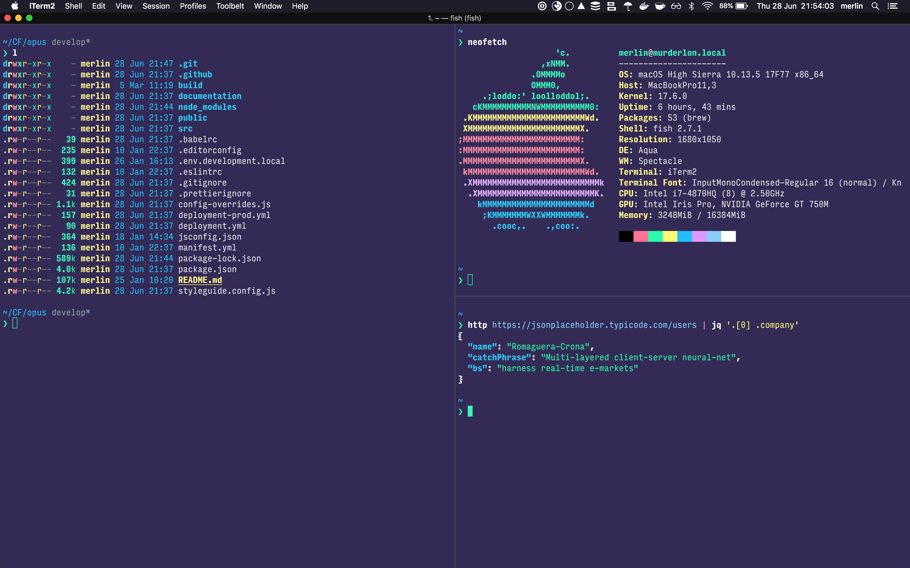

# Cyberpunk iTerm

> 👾 Hacker colorscheme for iTerm

_Tools used in preview: `exa`, `neofetch`, `httpie`, and `jq`._

## ‍💻 Install

1.  <a href="https://github.com/Murderlon/cyberpunk-iterm/blob/master/cyberpunk.itermcolors" download>Download</a>
2.  Go to 'Profiles' tab
3.  Click 'Colors'
4.  Import `cyberpunk.itermcolors`
5.  Select from color presets.
6.  👾

## 🙌 Credits

Shout out to [max-SS](https://github.com/max-SS) for creating the original [cyberpunk](https://github.com/max-SS/cyberpunk) for VS Code.

## ⚖️ Licence

[MIT](https://oss.ninja/mit/murderlon) © [Merlijn Vos](https://github.com/Murderlon).
